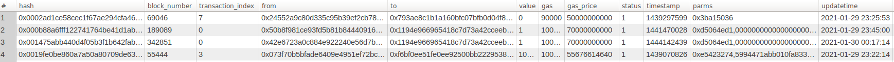

一个简单的eth合约地址解析服务

配置文件：
config.properties 中为项目相关配置，字段解释如下：

    db.init=false                       # 是否进行数据库初始化（首次启动设置为 true）
    db.host=127.0.0.1                   # 数据库IP
    db.port=3306                        # 数据库端口                  
    db.user=debian-sys-maint            # 用户名
    db.passwd=llYeLnx08z9YtEjT          # 密码
    db.name=ether_inner                 # 数据库名称
    eth.url=http://127.0.0.1:8545       # 以太坊节点 RPC地址
    point=0                             # 断点续传 （默认 0）

dal.properties 中是项目数据库相关操作，结构为 key=value 模式，value 为数据库操作参数化语句，在项目中通过 key 进行获取，注意使用是整条语句必须在同一行，不能换行。

    eg：
    querybyhash.eth_contract_transaction=SELECT * FROM `eth_contract_transaction` where `hash` = %(hash)s;
    则方法调用可以使用：
    result = query(dal.get_value("querybyhash.eth_contract_transaction"), {"hash":"0xb0e580cc2009b265ff3a413ffa47230d23fcbf7f7c2a36f10fd845537b9303f1"}})

DB：

数据库结构如上图,创建语句见项目 initsql.sql

    此项目解析出的数据只包含合约地址(to字段，为空 表示部署合约失败的交易)涉及到的交易
    parms 字段是解析后的参数数据，根据以太坊交易特性，此字段来自与交易结构提中input 字

    input 字段包含多种结构，前十位通常为方法定义，后面每64位为一个方法参数
注意：也有些input字段中包含的是合约编译后的二进制数据

    erc20智能合约方法定义方式：
    常见例如：transfer(address,uint256)
    编码为：web3.sha3("transfer(address,uint256)").substring(0,10)  -> "0xa9059cbb"
    balanceOf(address)
    编码为：web3.sha3("balanceOf(address)").substring(0,10)  -> "0x70a08231"

    常见的编码：
    transfer(address,uint256)： 0xa9059cbb
    balanceOf(address)：0x70a08231
    decimals()：0x313ce567
    allowance(address,address)： 0xdd62ed3e
    symbol()：0x95d89b41
    totalSupply()：0x18160ddd
    name()：0x06fdde03
    approve(address,uint256)：0x095ea7b3
    transferFrom(address,address,uint256)： 0x23b872dd
